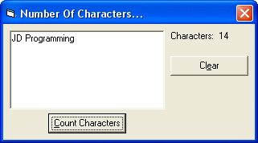

<div align="center">

## \[ A program to count the number of characters in a TextBox\. \]


</div>

### Description

This simple little program will count the number of characters in a TextBox. Please leave your comments and votes, thanks :)
 
### More Info
 
One TextBox, one Label, and two CommandButtons. (You just need to keep their default names).

The number of characters entered into the TextBox.


<span>             |<span>
---                |---
**Submitted On**   |
**By**             |[JamesJD](https://github.com/Planet-Source-Code/PSCIndex/blob/master/ByAuthor/jamesjd.md)
**Level**          |Beginner
**User Rating**    |3.0 (24 globes from 8 users)
**Compatibility**  |VB 3\.0, VB 4\.0 \(16\-bit\), VB 4\.0 \(32\-bit\), VB 5\.0, VB 6\.0
**Category**       |[Miscellaneous](https://github.com/Planet-Source-Code/PSCIndex/blob/master/ByCategory/miscellaneous__1-1.md)
**World**          |[Visual Basic](https://github.com/Planet-Source-Code/PSCIndex/blob/master/ByWorld/visual-basic.md)
**Archive File**   |[](https://github.com/Planet-Source-Code/jamesjd-a-program-to-count-the-number-of-characters-in-a-textbox__1-47446/archive/master.zip)


### Source Code

```
Sub Clear()
  Text1.Text = ""
  Label1.Caption = "Characters: "
  Text1.SetFocus
End Sub
Private Sub Command1_Click()
  Label1.Caption = "Characters: " & Str$(Len(Text1.Text))
  Text1.SetFocus
End Sub
Private Sub Command2_Click()
  Call Clear
End Sub
```

